# NSWI152 - Cloud Development

## LAB 1 - Create & Deploy simple Web Site to Azure App Service
1. Create new Visual Studio project using *ASP.NET Empty Web Site* template.
1. Add new item to the root folder of the project - *Web Form (place code in separate file)* - Deafult.aspx
1. In Default.aspx - Add `<asp:Label ID="MyLabel" runat="server" />` inside the `<form>` element.
	``` html
	<body>
		<form id="form1" runat="server">
			<div>
				<asp:Label ID="MyLabel" runat="server" />
			</div>
		</form>
	</body>
	```
1. In Default.aspx.cs `Page_Load` method - Set `Text` property of the `MyLabel` control to whatever string:
	``` csharp
	protected void Page_Load(object sender, EventArgs e)
	{
		MyLabel.Text = "Hello World from Azure";
	}
	```
1. (Start the WebSite locally to verify the result - `Ctrl`+`F5`)
1. Publish the WebSite to Azure AppService

   1. RClick project name in *Solution Explorer* window - Select *Publish Web Site*.
   1. Select *Microsoft Azure App Service* as the publish target.
   1. Create new AppService (or choose existing one if you already created one).
		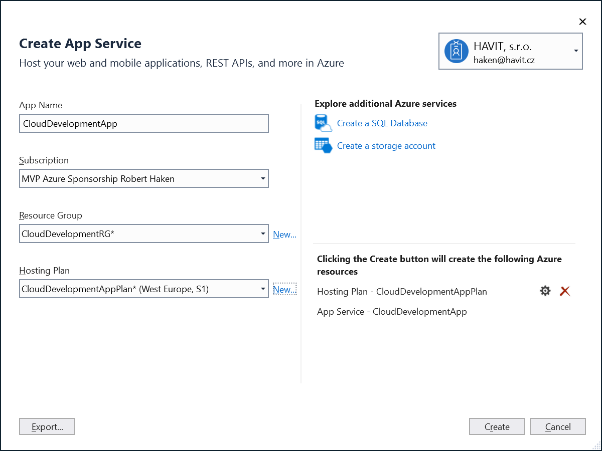
   1. Publish the website to Azure and check the result.
		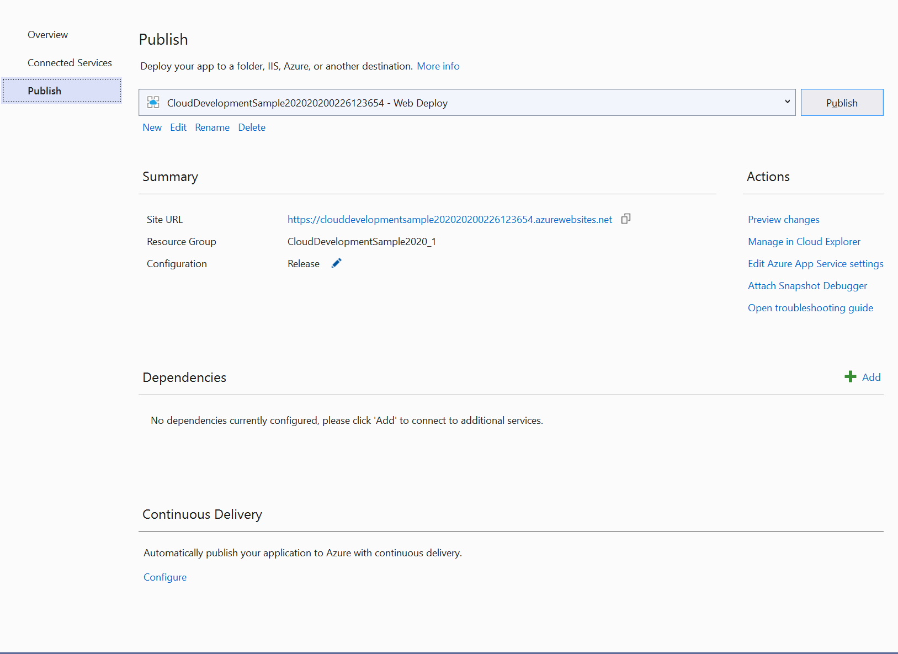
1. Change anything and re-publish the result to Azure.
### [OPTIONAL] Automatic Deployment from GitHub
8. Push the solution source code to your GitHub account.

    You might want to simplify your website by removing unnecessary configuration which can cause issues when building the app. See my [GitHub commit](https://github.com/hakenr/CloudDevelopment/commit/74f3b4f3f11e1ac05f2385b37b1aa47fb30f92e1).

9. Setup an automatic deployment from GitHub to Azure AppService:
   
   1. Create new Azure AppService using Azure Portal.
   1. Go to *Deployment Options* blade and set up your GitHub repository as deployment source (note other deployment sources available - VSTS, OneDrive, Dropbox, git, ...)
		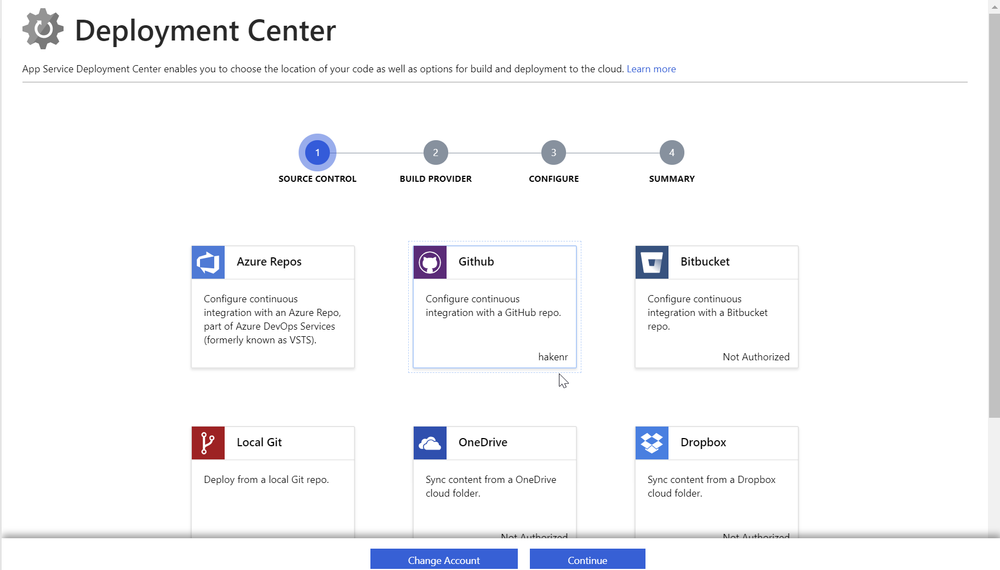
   1. Check the result - the application should be deployed within few seconds.
   1. Change anything in your website and push the commit to GitHub - the application should be redeployed within few seconds.


## LAB 2 - Web Job with Azure SQL connectivity
In this lab we will create and deploy a WebJob (background task) which connects to Azure SQL database. The job will run in scheduled time intervals, read data from a EmailQueue table and send e-mail via [SendGrid](https://docs.microsoft.com/en-us/azure/sendgrid-dotnet-how-to-send-email) mail service (in future lab we might move the queue from Azure SQL to Azure Storage Queues).
1. Create new Azure SQL server and database:
   1. Go to [Azure Portal](https://portal.azure.com) and use *Create Resource* button in left panel to create a new *SQL Database*.
   2. Fill in the name and other properties of the DB + create a new SQL server to host the DB ()

      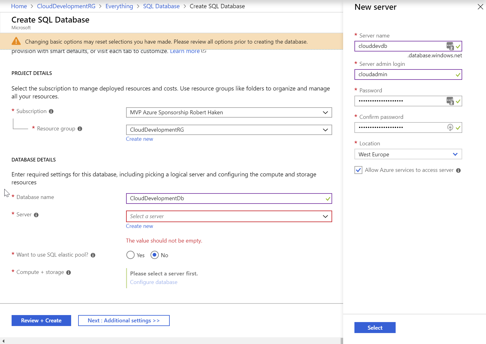

1. In Visual Studio open new SQL Query window for the new DB

	Note: In practice you usualy use [Microsoft SQL Server Management Studio](https://docs.microsoft.com/en-us/sql/ssms/download-sql-server-management-studio-ssms) or [Microsoft SQL Server Operations Studio](https://docs.microsoft.com/en-us/sql/sql-operations-studio/download) to perform DB-related development/management tasks. In this lab we will use plain Visual Studio to demonstrate an alternate option.
   1. In Visual Studio open *Cloud Explorer* panel (you can use *Quick Launch*) and navigate to your database - *SQL Databases* / *Open SQL Server Object Explorer* (r-click)

      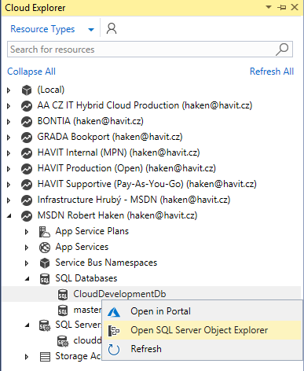

	  2. Connect to your Azure SQL server

      

	  3. Confirm adding of your current IP address to Azure SQL Server firewall (You can check firewall rules using Azure Portal - Go to you SQL Server and see *Firewall / Network Settings* section)

      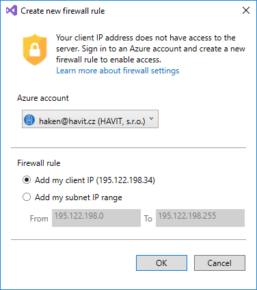

   4. In *SQL Server Object Explorer* navigate to your DB and open *New query...* (r-click)

      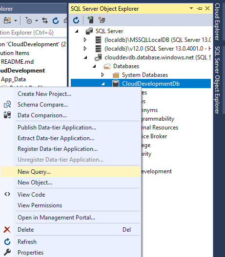

1. Create the *EmailQueue* table in your DB:
	``` sql
	CREATE TABLE dbo.EmailQueue	(
		ID int PRIMARY KEY NOT NULL IDENTITY (1, 1),
		Recipient nvarchar(MAX) NOT NULL,
		Subject nvarchar(400) NOT NULL,
		Body nvarchar(MAX) NOT NULL,
		Created datetime NOT NULL,
		Sent datetime NULL
	)
	```
1. [OPTIONAL] Create new SQL login account for the application not to use system administrator account

	Note: In real scenario you don't want your applications to use the system administrator account to access the DB. Dedicated login account for each client should be created (with restricted access rights).

   1. In *master* DB run the following SQL query
   ```sql
	CREATE LOGIN CloudDevLogin WITH PASSWORD = '***new password***'
   ```
   2. In your application DB run following SQL query
   ```sql
	CREATE USER CloudDevUser FOR LOGIN CloudDevLogin WITH DEFAULT_SCHEMA = dbo
	GO

	EXEC sp_addrolemember N'db_owner', N'CloudDevUser'
	GO
   ```
1. Add new *Console Application (.NET Framework)* project to the solution.
1. Add following code to *Program.cs* `Main` method (application entry-point):
	```csharp
		static void Main(string[] args)
		{
			while (true)
			{
				Console.WriteLine("Checking for new e-mails to be sent...");

				using (var conn = new SqlConnection(ConfigurationManager.ConnectionStrings["MainDatabase"].ConnectionString))
				{
					conn.Open();

					var cmd = new SqlCommand("SELECT * FROM EmailQueue WHERE Sent IS NULL", conn);

					using (var reader = cmd.ExecuteReader())
					{
						while (reader.Read())
						{
							Console.WriteLine($"Email ID:{reader["ID"]} found...");

							using (var smtpClient = new SmtpClient())
							{
								smtpClient.Host = ConfigurationManager.AppSettings["SmtpHost"];
								smtpClient.Credentials = new NetworkCredential(ConfigurationManager.AppSettings["SmtpUsername"], ConfigurationManager.AppSettings["SmtpPassword"]);

								smtpClient.Send(
									from: ConfigurationManager.AppSettings["SmtpFrom"],
									recipients: reader["Recipient"].ToString(),
									subject: reader["Subject"].ToString(),
									body: reader["Body"].ToString());

								// TODO: Write EmqilQueue.Sent to DB

								Console.WriteLine($"Email ID:{reader["ID"]} sent...");
							}
						}
					}
				}

				Thread.Sleep(30_000); // 30sec
			}
		}
	```
1. Add corresponding `ConnectionStrings` and `AppSettings` sections to *App.Config* file.

	Note: In real scenario you would set the values to development settings. These will be overriden by Azure Portal Application Settings (see bellow).

	```xml
	<connectionStrings>
		<!-- Will be replaced with Azure Portal Application Settings -->
		<add name="MainDatabase" connectionString="Data Source=sql.development.local;Initial Catalog=CloudDev;User Id=development;Password=development;Application Name=CloudDevWebJob"/>
	</connectionStrings>
	<appSettings>
		<!-- Will be replaced with Azure Portal Application Settings -->
		<add key="SmtpHost" value="mail.development.local" />
		<add key="SmtpUsername" value="" />
		<add key="SmtpPassword" value="" />
		<add key="SmtpFrom" value="haken@devmail.havit.cz" />
	</appSettings>
	```
1. Publish the result as Azure Web Job...
 
	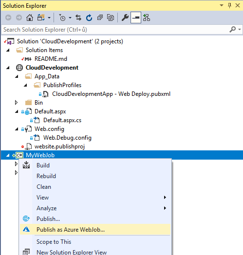

	Note: The job will be failing now. We have to set the production Application Settings.

1. [OPTIONAL] Create a new SendGrid account in Azure and use it's credentials to send mails.
1. Go to Azure Portal, locate the App Service hosting the WebJob and set appropriate Application Settings (ConnectionStrings and AppSettings):

	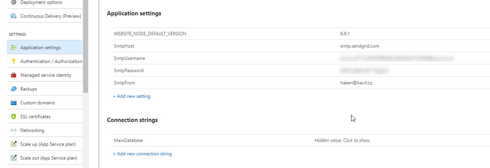

1. Try the job by adding a row to EmailQueue table.

## LAB3 - Application Insights [Ji�� Kanda]
1. In Azure Portal create a new Application Insights service associated to the App Service created in LAB1.
	1. You can easily create one through navigating to your App Service - Application Insights blade:

		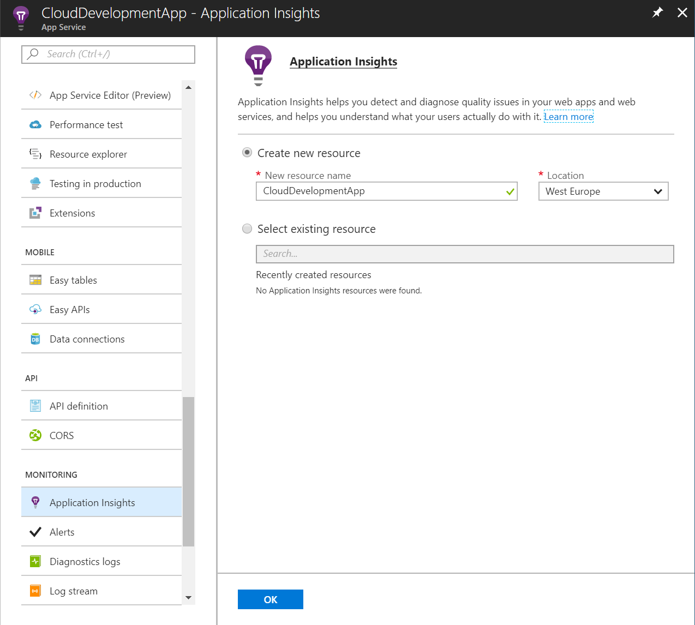

	2. Check *Application Settings* section - there is a new `APPINSIGHTS_INSTRUMENTATIONKEY` setting added automatically (If not, create one on your own - you can find the instrumentation key in *Properties* section of the Application Insights service.)
2. Install Application Install `Microsoft.ApplicationInsights.Web` NuGet Package to the Web Application project created in LAB1 and publish the project to Azure.

## LAB4 - Azure Storage Account - Blobs
[https://docs.microsoft.com/en-us/azure/storage/blobs/storage-quickstart-blobs-dotnet?tabs=windows](https://docs.microsoft.com/en-us/azure/storage/blobs/storage-quickstart-blobs-dotnet?tabs=windows)
1. In Azure Portal create a new Azure Storage Account - *StorageV2 (general purpose v2)*. Familiarize yourself with the configuration options available:

	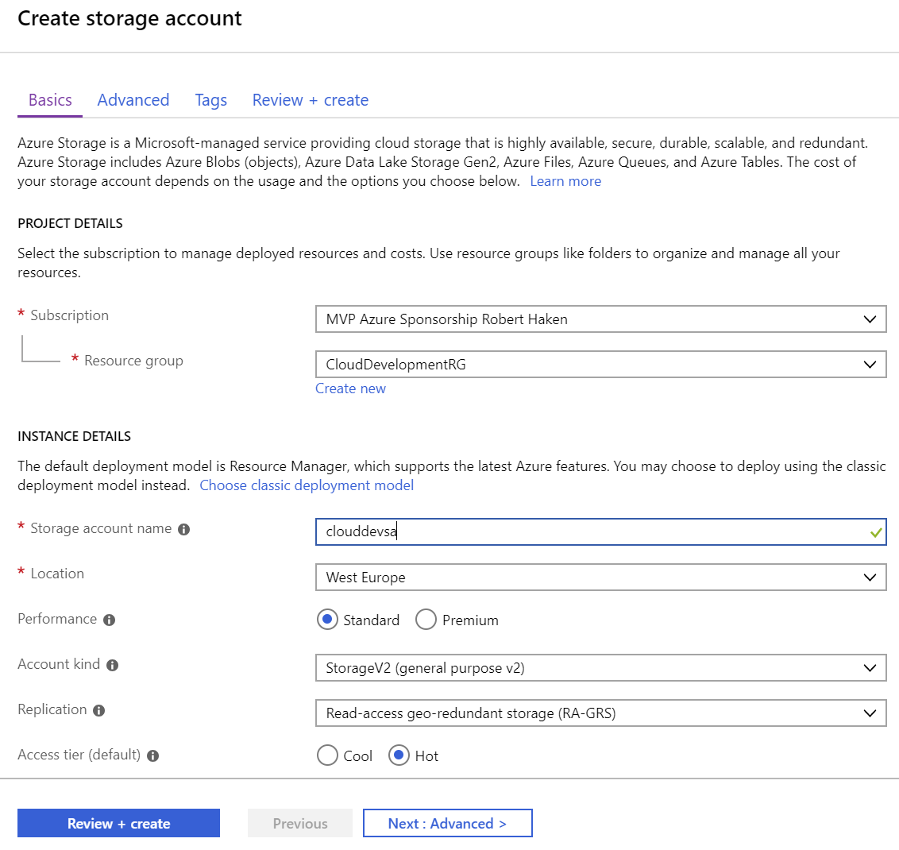

1. Add new container to the Blob service section of the storage account created:

	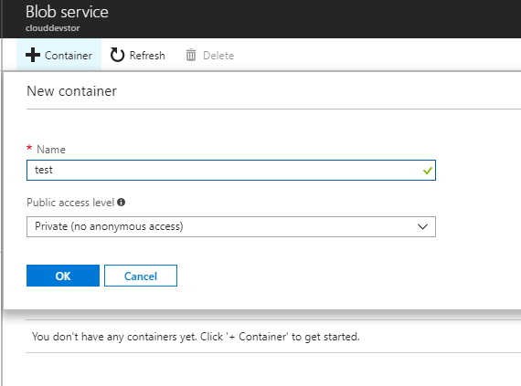

1. Install `Windows.AzureStorage` NuGet package to both WebApplication and WebJob projects in your solution.

1. In your Web Application, add a simple form which uploads a file to the blob container you created earlier.
	1. Add *FileUpload* control and a *Button* to your `Default.aspx` page
		```html
		<asp:FileUpload ID="MyFileUpload" runat="server" />
		<asp:Button ID="GoButton" Text="GO!" OnClick="GoButton_Click" runat="server" />
		```
	1. Add button-click handler to the `Default.aspx.cs` file
		```csharp
		protected void GoButton_Click(object sender, EventArgs e)
		{
			if (MyFileUpload.HasFile)
			{
				var storageAccount = CloudStorageAccount.Parse(ConfigurationManager.AppSettings["StorageAccountConnectionString"]);
				var blobClient = storageAccount.CreateCloudBlobClient();
				var containerReference = blobClient.GetContainerReference("test"); // namo of your container

				var blobReference = containerReference.GetBlockBlobReference(MyFileUpload.FileName);
				blobReference.UploadFromStream(MyFileUpload.FileContent);
			}
		}
		```
      1. Add `StorageAccountConnectionString` to your web.config file (you will find the connection string on Azure Portal in *Access Keys* section of the Storage Account blade). For production deployment you can use the *Application Settings* section of App Service to set the value.

1. In yout Web Application, add a simple list of files stored in your blob container + simple download action.
   1. Add following code snippet to your Default.aspx file:
		```xml
		<h1>Files</h1>
		<asp:Repeater ID="FilesRepeater" ItemType="Microsoft.WindowsAzure.Storage.Blob.IListBlobItem" runat="server">
			<ItemTemplate>
				<asp:LinkButton ID="FileLink" CommandArgument="<%# Item.Uri %>" Text="<%# Item.Uri %>" OnCommand="FileLink_Command" runat="server" /><br />
			</ItemTemplate>
		</asp:Repeater>
		```
   2. Add following code snippet to your Default.aspx.cs file:
		```csharp
		protected override void OnPreRender(EventArgs e)
		{
			var storageAccount = CloudStorageAccount.Parse(ConfigurationManager.AppSettings["StorageAccountConnectionString"]);
			var blobClient = storageAccount.CreateCloudBlobClient();
			var containerReference = blobClient.GetContainerReference("test");

			var blobs = containerReference.ListBlobs();
			FilesRepeater.DataSource = blobs;
			FilesRepeater.DataBind();
		}

		protected void FileLink_Command(object sender, CommandEventArgs e)
		{
			var storageAccount = CloudStorageAccount.Parse(ConfigurationManager.AppSettings["StorageAccountConnectionString"]);
			var blobClient = storageAccount.CreateCloudBlobClient();

			var blobReference = new CloudBlockBlob(new Uri((string)e.CommandArgument), blobClient);
			blobReference.DownloadToStream(Response.OutputStream);
		}
		```


## LAB5 - Azure Storage - Queues
[https://docs.microsoft.com/en-us/azure/storage/queues/storage-dotnet-how-to-use-queues](https://docs.microsoft.com/en-us/azure/storage/queues/storage-dotnet-how-to-use-queues)
1. Send Message
   1. `Default.aspx`
	   ```xml
		<asp:TextBox ID="QueueMessageTB" runat="server" />
		<asp:Button ID="SendToQueueButton" Text="Send to Queue" OnClick="SendToQueueButton_Click" runat="server" />
	   ```
   1. `Default.aspx.cs`
		```csharp
		protected void SendToQueueButton_Click(object sender, EventArgs e)
		{
			var storageAccount = CloudStorageAccount.Parse(ConfigurationManager.AppSettings["StorageAccountConnectionString"]);
			var queueClient = storageAccount.CreateCloudQueueClient();
			var queueReference = queueClient.GetQueueReference("test"); // your queue name

			var message = new CloudQueueMessage(QueueMessageTB.Text);
			queueReference.AddMessage(message);
		}
		```
2. Retrieve Message
   1. `Default.aspx`
	   ```xml
		<asp:Label ID="QueueMessageLb" runat="server" />
		<asp:Button ID="GetMessageButton" Text="Get from Queue" OnClick="GetMessageButton_Click" runat="server" />
	   ```
   1. `Default.aspx.cs`
		```csharp
		protected void GetMessageButton_Click(object sender, EventArgs e)
		{
			var storageAccount = CloudStorageAccount.Parse(ConfigurationManager.AppSettings["StorageAccountConnectionString"]);
			var queueClient = storageAccount.CreateCloudQueueClient();
			var queueReference = queueClient.GetQueueReference("test"); // your queue name

			var message = queueReference.GetMessage();
			if (message != null)
			{
				QueueMessageLb.Text = message.AsString;
				queueReference.DeleteMessage(message);
			}
			else
			{
				QueueMessageLb.Text = "No message returned...";
			}
		}
		```
        
# LAB 6 - Service Bus
- Official documentation: [https://azure.microsoft.com/en-us/services/service-bus/](https://azure.microsoft.com/en-us/services/service-bus)
- [Presentation (PDF)](presentations/service_bus.pdf)

### Part 1: Microsoft Azure
In Microsoft Azure portal create new **Service Bus** namespace. Recommended pricing tier is Standard (allows to work with Topics)

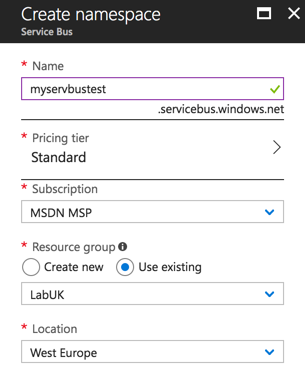

### Part 2: Working with Queues and Topics
- [How to create Queue and Send/Receive messages in .NET](https://docs.microsoft.com/en-us/azure/service-bus-messaging/service-bus-dotnet-get-started-with-queues)
- [How to create Topic and Publish/Subscribe messages in .NET](https://docs.microsoft.com/en-us/azure/service-bus-messaging/service-bus-dotnet-how-to-use-topics-subscriptions)

# LAB 7 - Azure Redis
- Official documentation: [https://docs.microsoft.com/en-us/azure/redis-cache/](https://docs.microsoft.com/en-us/azure/redis-cache/)
- Recommended reading and video: [https://www.miroslavholec.cz/blog/uvod-do-redis-a-prakticke-navrhove-vzory--wug-praha-2017](https://www.miroslavholec.cz/blog/uvod-do-redis-a-prakticke-navrhove-vzory--wug-praha-2017)
- [Presentation (PDF)](presentations/redis.pdf)

### Part 1: Redis in Microsoft Azure
In Microsoft Azure portal create new **Redis** service. Recommended pricing tier is Basic and for education reasons I would recommend to allow port 6379 (non SSL).

### Part 2: Managing Redis locally
Download Redis Server installer from https://github.com/MicrosoftArchive/redis/releases and install with default settings. 

### Part 3: Working with Redis in .NET application
Pull changes from this repository to your computer. You should see new Redis solution folder with RedisCache project. It is a simple console application. 

- Implement Redis client libraries for .NET
- Implement caching (get and set operations)
- Implement counter for each user request


# LAB 8 - Serverless Computing
- Official documentation (Azure Functions): [Azure Functions documentation](https://docs.microsoft.com/en-us/azure/azure-functions/)
- Official documentation (Azure Logic Apps): [Azure Logic Apps documentation](https://docs.microsoft.com/en-us/azure/logic-apps/)
- Recommended reading: [Serverless Computing video + resources in CZ](https://www.miroslavholec.cz/blog/serverless-computing-global-azure-bootcamp-brno-2017)
- [Presentation (PDF)](presentations/serverless.pdf)

During LAB 8 you will create your own Logic App workflow. See [presentation](presentations/serverless.pdf) for more information.

# LAB 9 - Azure Search
- Official documentation (Azure Search): [Azure Search documentation](https://docs.microsoft.com/en-us/azure/search)
- [Presentation (PDF)](presentations/azuresearch.pdf)

### Part 1: Azure Search in Microsoft Azure
In Microsoft Azure portal create new **Azure Search** service. You can choose Free pricing tier for our purposes. Provisioning of your service can take up to 15 minutes.

### Part 2: Download Updated project from this Repo
You should see new solution folder **AzureSearch**. There is a new WinForm project in this solution folder. Try to build it.


### Part 3: Introduction to Azure Search
[Presentation (PDF)](presentations/azuresearch.pdf)

### Part 4: Setup SDK and application logic

Step 1: Add new NuGet package Microsoft.Azure.Search to your project

Step 2: Implement ButtonIndex_Click event

	using (var serviceClient = new SearchServiceClient("name", new SearchCredentials("key")))
	{
	   var actions = new IndexAction<Article>[]
	   {
	      IndexAction.MergeOrUpload(article)
	   };

	   var batch = IndexBatch.New(actions);

	   ISearchIndexClient indexClient = serviceClient.Indexes.GetClient("articles");
	   indexClient.Documents.Index(batch);
	}

Step 3: Create new Index in Azure Search

- visit portal.azure.com and find your Azure Search service
- choose Indexes item and click on the Add index button
- define your Index (do not forget use all fields from Article class)


 
Step 4: Implement ButtonSearch_Click event

    using (var indexClient = new SearchIndexClient("name", "index", new SearchCredentials("key")))
    {
       var parameters = new SearchParameters()
       {
          // Select = new[] { "" }
       };

       var results = indexClient.Documents.Search<Article>(Keyword.Text, parameters);

       ResultGrid.DataSource = results.Results.Select(x => new
       {
          Score = x.Score,
          Title = x.Document.Title,
          Category = x.Document.Category,
          Text = x.Document.Text
       }).OrderByDescending(x => x.Score).ToList();
    }

### Part 5: Optional tasks

**Scoring profiles**: Create new default scoring profile so that Title will have higher priority in search results than other fields.

**Scoring functions**: Extend your scoring profile with scoring functions. Lets say we want to prioritize newest items (use Created field).